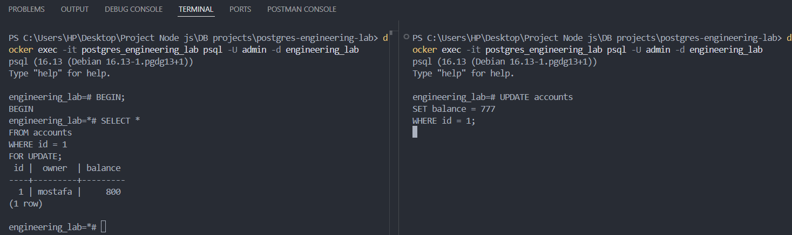
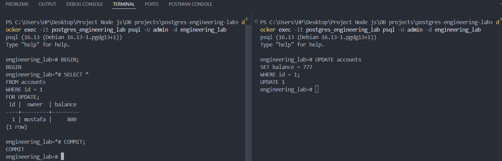
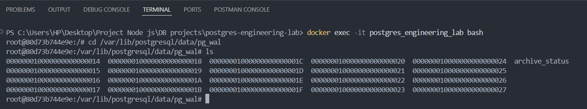

# PostgreSQL Engineering Lab

A deep, hands-on exploration of how PostgreSQL works internally — far beyond simply writing SQL queries.

This project focuses on understanding real database engine behavior through practical experiments involving:

- Query execution plans
- Index internals
- Heap storage
- MVCC
- Transaction isolation
- WAL (Write-Ahead Logging)
- Locks & deadlocks
- Query planner decisions
- Large-scale datasets
- Performance optimization

Unlike many database tutorials that explain concepts only theoretically, this repository demonstrates how PostgreSQL behaves under real workloads using millions of rows and detailed execution analysis.

The primary goal is not just learning how to _use_ PostgreSQL, but understanding how a real DBMS engine thinks, plans, optimizes, and executes internally.

---

# Installation & Running

## Prerequisites

Make sure you have installed:

- Docker
- Docker Compose

---

## Start PostgreSQL Container

Run:

```bash
docker compose up -d
```

This will:

- Pull PostgreSQL 16 image
- Create the PostgreSQL container
- Apply custom PostgreSQL configuration
- Execute initialization scripts automatically

---

## Verify Running Container

```bash
docker ps
```

You should see:

```text
postgres_engineering_lab
```

---

## Connect To PostgreSQL

```bash
docker exec -it postgres_engineering_lab psql -U admin -d engineering_lab
```

---

## Stop Containers

```bash
docker compose down
```

---

## Remove Containers & Volumes

```bash
docker compose down -v
```

This removes all persisted database data.

---

# Project Structure

```text
postgresql-engineering-lab/
│
├── docker-compose.yml
│
├── postgres/
│   ├── init/
│   │   ├── 01-schema.sql
│   │   ├── 02-seed.sql
│   │   ├── 03-indexes.sql
│   │   └── 04-accounts.sql
│   │
│   └── config/
│       └── postgresql.conf
│
├── .gitignore
├── screenshots/
│
└── README.md
```

# Why PostgreSQL Instead of MySQL?

This project intentionally uses PostgreSQL because PostgreSQL uses:

- Heap Storage
- Secondary Indexes

instead of MySQL InnoDB’s clustered index architecture.

This allows deeper exploration of advanced internals such as:

- Heap Fetches
- Index Scan vs Index Only Scan
- Bitmap Heap Scan
- MVCC visibility rules
- WAL behavior
- Query planner strategies
- Random Heap Access costs

---

# Technologies Used

- PostgreSQL
- Docker

---

# Project Goals

This repository demonstrates practical understanding of:

- ACID properties
- Query execution internals
- PostgreSQL storage architecture
- Heap & secondary indexes
- B-Tree / B+Tree indexes
- Query planner decisions
- Sequential Scan
- Index Scan
- Index Only Scan
- Bitmap Heap Scan
- Composite indexes
- MVCC
- Locks & Deadlocks
- WAL internals
- Crash recovery
- Isolation levels
- Buffer/cache behavior
- Query optimization
- Parallel execution
- Random Heap Access cost
- PostgreSQL optimizer cost model

---

# Dataset

The project uses a large dataset containing approximately:

```text
1,000,000+ rows
```

to simulate realistic database workloads and demonstrate how PostgreSQL changes execution strategies depending on result size and query selectivity.

---

# ACID Properties

# 1. Atomicity

A transaction either fully succeeds or fully fails.

PostgreSQL achieves Atomicity using:

- WAL (Write-Ahead Logging)
- Rollback mechanisms
- Commit strategies
- Buffer management

### Core Commands

```sql
BEGIN;
COMMIT;
ROLLBACK;
```

---

# 2. Consistency

Consistency ensures that the database always remains valid before and after every transaction.

## Types of Consistency

### Consistency in Data

Ensures that:

- Constraints are respected
- Schema rules remain valid
- Invalid data is rejected

Example:

```sql
CHECK(balance >= 0)
```

---

### Consistency in Reads

Ensures logically related data stays synchronized.

Example:

```text
photo.likes_count == number_of_rows_in_likes_table
```

---

# 3. Isolation

Each transaction behaves as if it is the only transaction running in the system.

PostgreSQL uses:

- MVCC
- Isolation Levels
- Locks
- Snapshots

to implement isolation safely and efficiently.

---

# 4. Durability

Once a transaction is committed, its changes must survive:

- Power failures
- Database crashes
- Server restarts
- System failures

PostgreSQL guarantees durability using:

- WAL
- fsync
- Crash recovery
- Redo logging

---

# Indexing Internals

# What Is an Index?

An index is an additional data structure built on one or more columns to accelerate data retrieval.

PostgreSQL primarily uses:

```text
B-Tree / B+Tree
```

indexes.

Indexes dramatically reduce query execution time by avoiding full table scans when possible.

---

# Scan Types Explored

This project explores the following scan strategies:

- Sequential Scan
- Index Scan
- Index Only Scan
- Bitmap Heap Scan
- Composite Index Scan

---

# Sequential Scan Example

```sql
EXPLAIN ANALYZE
SELECT *
FROM employees
WHERE country = 'Egypt';
```

## Query Plan

```text
Seq Scan on employees
Execution Time: 175.518 ms
```

## Why Did PostgreSQL Use Sequential Scan?

Because no index existed on the `country` column.

PostgreSQL therefore performed a:

```text
Full Table Scan
```

reading every row sequentially from the heap.

---

# Index Scan Example

```sql
SET enable_bitmapscan = OFF;

EXPLAIN ANALYZE
SELECT *
FROM employees
WHERE salary = 500;
```

## Query Plan

```text
Index Scan using idx_salary_include_name
Execution Time: 0.077 ms
```

## Why Was It Faster?

Because PostgreSQL used the B+Tree index to directly locate matching rows instead of scanning the entire table.

This drastically reduced execution time.

---

# Bitmap Heap Scan Example

```sql
EXPLAIN (ANALYZE, BUFFERS)
SELECT *
FROM employees
WHERE salary = 500;
```

## Query Plan

```text
Bitmap Heap Scan
Heap Blocks: exact=12
```

## What Happened Internally?

PostgreSQL:

1. Searched the B+Tree index
2. Collected matching row pointers
3. Built a bitmap of heap pages
4. Fetched only required pages from the heap

---

# Why Bitmap Heap Scan Exists

Bitmap scans reduce:

```text
Random Heap Access
```

which becomes expensive when many rows are returned.

Instead of jumping randomly between index and heap repeatedly, PostgreSQL groups heap accesses efficiently.

---

# Index Only Scan

```sql
EXPLAIN (ANALYZE, BUFFERS)
SELECT name
FROM employees
WHERE salary = 500;
```

## Query Plan

```text
Index Only Scan
Heap Fetches: 0
```

---

# Why Was the Heap Not Accessed?

Because the index was created as:

```sql
CREATE INDEX idx_salary_include_name
ON employees(salary)
INCLUDE(name);
```

The `name` column already existed inside the index leaf nodes.

Therefore PostgreSQL retrieved the result directly from the index without accessing the heap.

---

# Why Is This Important?

Index Only Scan is extremely efficient because:

- No heap access occurs
- Fewer disk reads are needed
- Query execution becomes significantly faster

However, adding too many included columns increases index size and slows down writes.

---

# Composite Index Example

```sql
CREATE INDEX idx_salary_department
ON employees(salary, department_id);
```

---

# Query Example

```sql
SELECT *
FROM employees
WHERE salary = 5000
AND department_id = 7;
```

## Query Plan

```text
Index Scan using idx_salary_department
```

---

# Why Did PostgreSQL Use Index Scan Here?

Because:

- `salary = 5000` is highly selective
- Very few rows matched
- Random heap access remained inexpensive

This made Index Scan the optimal strategy.

---

# Why PostgreSQL Sometimes Ignores Indexes

Example:

```sql
SELECT *
FROM employees
WHERE salary > 0;
```

Even though `salary` is indexed, PostgreSQL still chose:

```text
Seq Scan
```

---

# Why?

Because nearly all rows matched the condition.

Using the index would require:

```text
1,000,000 ×
(index lookup + heap fetch)
```

which becomes more expensive than scanning the heap sequentially.

---

# PostgreSQL Planner Strategy

| Result Size       | Preferred Strategy |
| ----------------- | ------------------ |
| Small Result Set  | Index Scan         |
| Medium Result Set | Bitmap Heap Scan   |
| Large Result Set  | Sequential Scan    |

---

# Query Cache Behavior

Running the same query multiple times resulted in significantly faster execution.

Why?

Because PostgreSQL and the operating system cached previously accessed pages in memory, reducing expensive disk I/O.

---

# MVCC (Multi-Version Concurrency Control)

MVCC is one of PostgreSQL’s most powerful internal mechanisms.

It allows:

- Readers to avoid blocking writers
- Writers to avoid blocking readers

PostgreSQL achieves this by storing multiple row versions internally.

---

# Isolation Levels

This project explores:

- Read Committed
- Repeatable Read

---

# Read Committed

PostgreSQL’s default isolation level.

Behavior:

- Every query receives a fresh snapshot
- Prevents Dirty Reads
- Allows Non-Repeatable Reads
- Allows Phantom Reads

---

# Repeatable Read

```sql
BEGIN ISOLATION LEVEL REPEATABLE READ;
```

Behavior:

- Entire transaction keeps one consistent snapshot
- Prevents Non-Repeatable Reads
- Prevents Lost Updates
- Uses MVCC internally

---

# Dirty Read

PostgreSQL does not allow Dirty Reads even under:

```sql
READ UNCOMMITTED
```

because PostgreSQL internally maps it to:

```text
READ COMMITTED
```

using MVCC.

---

# Lost Update Problem

Two concurrent transactions updated the same row.

The second transaction overwrote the first transaction’s changes.

This phenomenon is called:

```text
Lost Update
```

---

# Solving Lost Updates Using Locks

```sql
SELECT *
FROM accounts
WHERE id = 1
FOR UPDATE;
```

This places a row-level lock preventing concurrent modifications until the transaction finishes.

---

# Locks

This project explores:

- Row Locks
- Table Locks
- Page Locks
- Database Locks

and how PostgreSQL coordinates concurrent transactions safely.

---

# WAL (Write-Ahead Logging)

One of PostgreSQL’s most critical internal systems.

---

# What Is WAL?

Before modifying actual database pages, PostgreSQL first writes changes into:

```text
WAL Logs
```

---

# Why?

To guarantee:

- Atomicity
- Durability
- Crash Recovery

---

# Crash Recovery

If PostgreSQL crashes:

- Committed transactions are replayed (REDO)
- Uncommitted transactions are rolled back

using WAL records.

---

# Performance Topics Covered

- Query planning
- Cost estimation
- Random vs Sequential I/O
- Parallel Query
- Worker processes
- ANALYZE
- Selectivity
- Buffers
- Heap Blocks

---

# Screenshots

## Read Committed

```text
[ Place Screenshot Here ]
screenshots/read-committed.png
```

Demonstrates PostgreSQL’s default isolation level where every query receives a fresh snapshot.

Shows:

- Prevention of Dirty Reads
- Visibility behavior under MVCC
- Snapshot refresh between queries

---

## Repeatable Read


Demonstrates snapshot retention throughout the entire transaction.

Shows:

- Stable reads
- MVCC snapshot preservation
- Prevention of Non-Repeatable Reads

---

## Dirty Read Prevention


Demonstrates that PostgreSQL does not allow Dirty Reads even under `READ UNCOMMITTED`.

---

## Lost Update


Shows how concurrent transactions can overwrite each other’s updates.

---

## Row-Level Locks



Demonstrates:

```sql
SELECT * FROM accounts
WHERE id = 1
FOR UPDATE;
```

and how PostgreSQL blocks concurrent modifications.

---

## Lock Release



Shows how waiting transactions continue immediately after lock release.

---

## WAL Segments



We use it to store changes before applying them to the database to prevent crash issues.
If a crash happens after commit, a **redo** is performed; if before commit, an **undo** is applied.
This is implemented using **WAL (Write-Ahead Logging)** to ensure **durability**.

---

# Key Learning Outcomes

After completing this project, I gained practical understanding of:

- How PostgreSQL executes queries internally
- Why databases choose different scan types
- How indexes truly work
- How MVCC prevents concurrency issues
- Why WAL is critical for durability
- How query planners estimate execution cost
- Why indexes are not always beneficial
- How heap fetches affect performance
- Why PostgreSQL is highly optimized for concurrency

---

# Final Notes

This repository is designed as a database engineering laboratory rather than a simple CRUD application.

The primary focus is understanding how PostgreSQL behaves internally under:

- Real workloads
- Large datasets
- Concurrent transactions
- Complex query patterns

The experiments inside this repository aim to bridge the gap between:

```text
Writing SQL Queries
```

and:

```text
Understanding How a Real Database Engine Actually Works Internally
```
